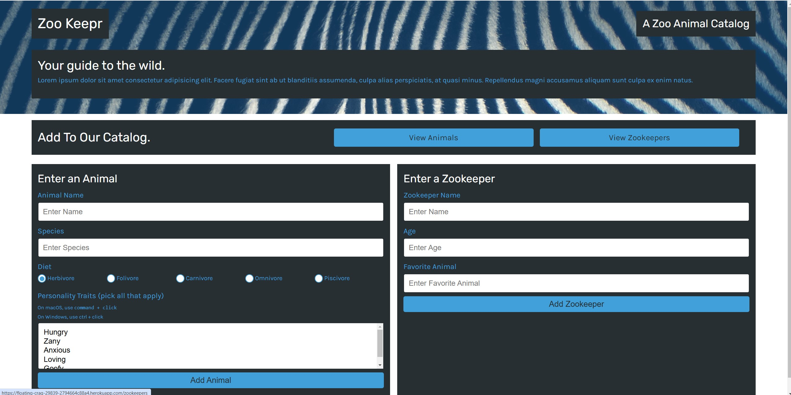

# Zookeepr

## Description

I created a web server using the Express.js framework and added a front-end application that the local zoo was developing, called Zoo Keepr. The site’s data will live on the server I built so that anyone can access it without having to download it. I also deployed my application to Heroku, a cloud application platform that allows you to deploy applications with servers to a webpage.

## Requirements

For development, you will only need Node.js.

## Installation

### Node installation on Windows

Please visit [Official Node.js Website](https://nodejs.org/) and download the installer.
Also, be sure to have `git` available in your PATH, `npm` might need it (You can find git [here](https://git-scm.com/)).

To install all node modules and dependencies, please run the command. npm install

## Usage

## Technologies Used

- JavaScript
- Node.js
- Express.js
- Jest (TDD)

## Contributions

- Shane Bramble-Wade

## Project Status

Project is: _completed_

## Contact

Created by [@kranniax](https://twitter.com/kranniax) - feel free to contact me!
